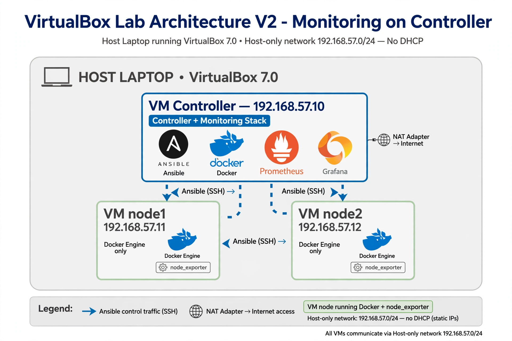

# ITI - Ansible + Docker + Monitoring Lab
## Laboratório de ITI com Ansible e Docker em VirtualBox

[](https://releases.ubuntu.com/)
[](https://www.virtualbox.org/)
[](https://docs.ansible.com/)

[🇵🇹 Português](#-português) | [🇬🇧 English](#-english)

---

### 🇵🇹 Português

Base do Laboratório de virtualização para o projeto prático da UC de Infraestruturas e Tecnologias de Informação (ITI), Departamento de Sistemas de Informação, Universidade do Minho. O objetivo é criar um ambiente isolado, reprodutível e seguro para desenvolver competências em Ansible, Docker e Monitorização (Prometheus/Grafana), sem recorrer a cloud pública.

#### Arquitetura



*   **Host:** Portátil com VirtualBox 7.x
*   **Rede Host-only `192.168.57.0/24` SEM DHCP:** rede de gestão. Isola o lab da rede campus/casa.
*   **Controlador `192.168.57.10`:** 2 vCPU / 4GB RAM / 20GB. Ubuntu Server 26.04.1, incorpora `ansible-core` e `community.docker`. É a única VM a que os alunos precisam aceder e devem fazê-lo por SSH a partir do host.
*   **Nós `192.168.57.11`, `.12`...:** 1 vCPU / 2GB RAM / 10GB. Imagem **minimized** do Ubuntu Server 26.04.1. Docker será já instalado via Ansible.
*   **Acesso Internet:** Adapter 1 em NAT (após configuração inicial em Bridge). Apenas para `apt` e pull de imagens.

#### Estrutura do Repositório

```
/ (root)
├── README.md                              <- este ficheiro
├── architecture.png                       <- diagrama acima
├── docs/
│   ├── 01-controlador.md                  <- Setup detalhado do Controlador
│   └── 02-no-referencia-e-clones.md       <- Golden image minimized + clones + sysprep
├── ansible/
│   ├── inventory.ini                      <- Inventário com node1/node2
│   ├── 01-install-docker.yml              <- (a criar) Instala Docker nos nós
│   ├── 02-deploy-monitoring.yml           <- (a criar) Prometheus + Grafana
│   └── group_vars/
└── scripts/
    └── sysprep.sh                         <- Script de limpeza para clones
```

#### Como começar

**1. Pré-requisitos:** VirtualBox 7.x, ISO Ubuntu Server 26.04.1, 8GB RAM livre no host (mínimo).

**2. Controlador:** Seguir passo-a-passo em [docs/01-controlador.md](docs/01-controlador.md)
> Inclui criação de swap, extensão LVM e instalação correta de `ansible-core` (Nota: não usar `ppa:ansible/ansible`).

**3. Nó de referência:** Seguir [docs/02-no-referencia-e-clones.md](docs/02-no-referencia-e-clones.md)
> Cobre porque o `minimized` não tem `nano`, `netplan`, `ping`, como corrigir `Permissions too open`, e o `sysprep` obrigatório (`ssh-keygen -A` + `systemd-machine-id-setup`) para o SSH voltar a arrancar nos clones.

**4. Validação:**
```bash
# no controlador
ansible -i ansible/inventory.ini docker_nodes -m ping
# deve dar pong em node1 e node2
```

#### Notas de Segurança para Alunos

*   OpenSSH com password auth é apenas para lab. Em produção usar chaves.
*   Após configuração inicial, mudar Adapter 1 de Bridge para NAT e aceder apenas via Host-only.
*   Nunca expor a rede `192.168.57.0/24` para fora do VirtualBox.

---

### 🇬🇧 English

Hands-on for a base lab to support the project development for Infrastructure and Integration Technologies (ITI) course, Depatment of Information Systems, University of Minho. Goal is to build an isolated, reproducible and secure environment to develope skills in Ansible, Docker and Monitoring (Prometheus/Grafana) without public cloud.

#### Architecture

Same as diagram above.

*   **Host-only `192.168.57.0/24` NO DHCP:** management network, isolated from campus/home.
*   **Controller `192.168.57.10`:** 2 vCPU / 4GB / 20GB. Ubuntu Server 26.04.1 runs `ansible-core` and `community-docker`. It is the only VM that practitioners should access from the host via SSH.
*   **Nodes `192.168.57.11`, `.12`:** 1 vCPU / 2GB / 10GB. Ubuntu Server 26.04.1 minimized. Docker to be installed via Ansible.

#### Repository Structure

Same as PT section. `/docs` contains step-by-step guides, `/ansible` the YAML example playbooks.

#### Quick Start

1. Follow [docs/01-controlador.md](docs/01-controlador.md) for controller setup
2. Follow [docs/02-no-referencia-e-clones.md](docs/02-no-referencia-e-clones.md) for golden image and clones
3. Validate with `ansible -m ping`

#### Key Troubleshooting Learned

| Symptom | Root Cause | Fix |
|---|---|---|
| `enp0s8` has no IPv4 | Host-only without DHCP + `dhcp4: true` | Use `dhcp4: false` + `addresses: [192.168.57.X/24]` |
| `Permissions too open` | netplan file 644 | `chmod 600` |
| `netplan: not found` | minimized has no netplan | `apt install netplan.io` |
| No `ping`/`nano` | minimized is minimal | `apt install iputils-ping nano` |
| SSH fails after clone | sysprep removed host keys | `ssh-keygen -A && systemctl restart ssh` |

---

### Autores / Authors

ITI - 2025/2026 - Docente: Henrique Santos
Este laboratório foi desenvolvido com apoio de **Meta AI (Muse Spark)** no diagnóstico de erros, validação de comandos e formatação da documentação.
> This lab was developed with assistance from **Meta AI (Muse Spark)** for troubleshooting, command validation and documentation formatting.
Licença: MIT - Uso educacional.

### Agradecimentos / Acknowledgements

*   Meta AI pela ajuda na depuração da rede Host-only, sysprep e correção dos guias PT/EN.
*   Comunidade Ubuntu e Ansible.
